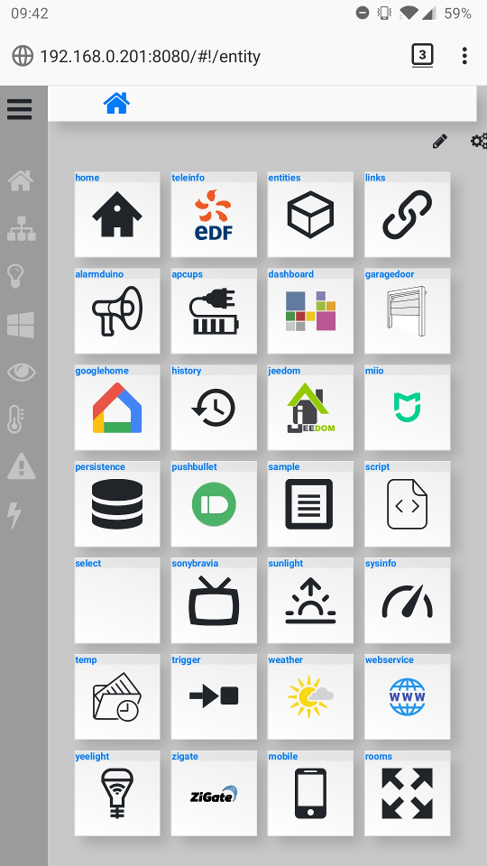
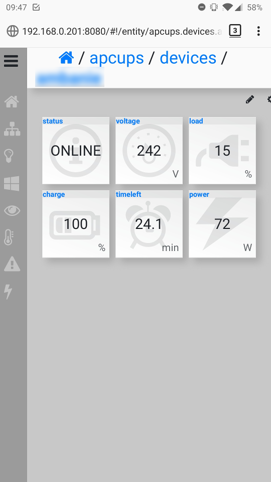
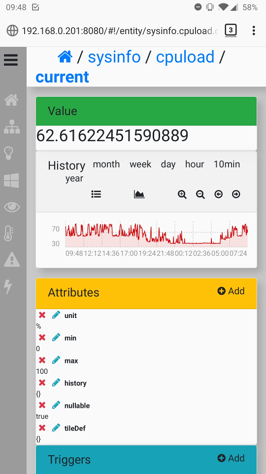
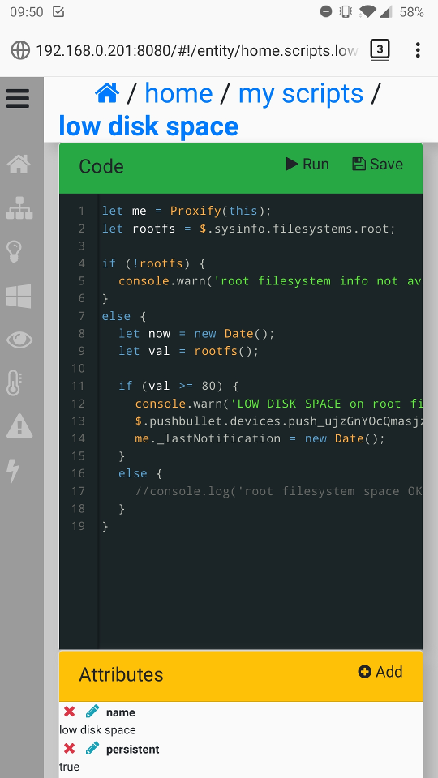

# domonode

This project is a home automation framework software.
__It is under active (private) development__ d'ont expect that much from here.

### just a placeholder ; no code available ... yet

The state of this personal project is currently still under heavy development. The code isn't clean yet and lot's of refactoring must be done.
Therefore, even if its target is to be published someday on github, there is nothing to show here for the moment.

### a few screenshots of the web interface:

These screenshots have been taken from the mobile version of the web interface, which is one of the numerous plugins developped for domonode (it's little name being the `dashboard` plugin).
This is the version of domonode currently running in my house.

A list of active plugins in my domonode instance:

Some values exposed by the APC UPS plugin:

The details of an entity of type `value`, here the CPU load of the server:

The details of an entity of type `script`,trigerred when the filesystem space `value` changes, and which throws a pushbullet notification when there's low disk space on the server's filesystem.

